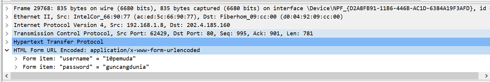
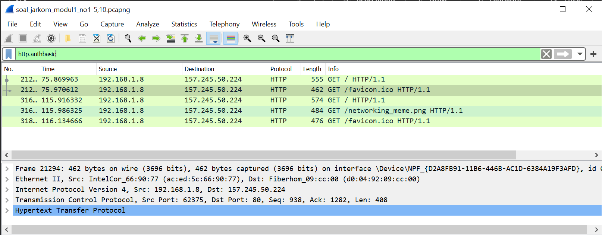
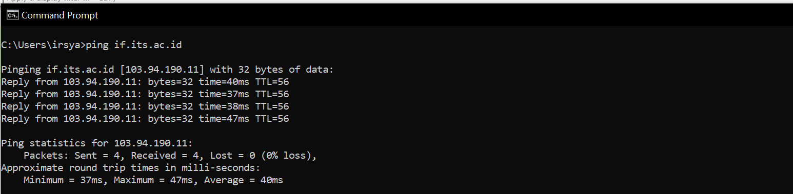
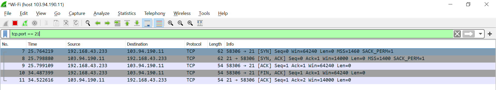
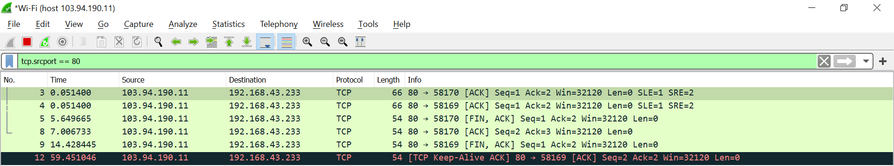
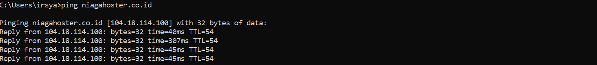
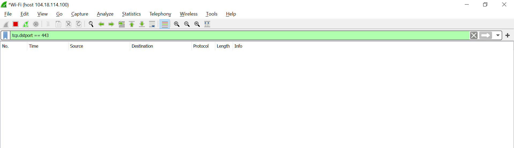
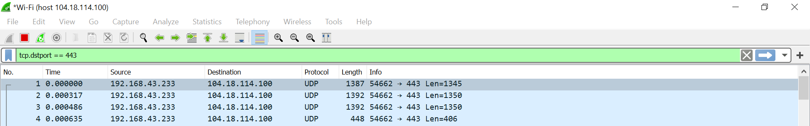

# Lapres Modul 1_T19

**Muhammad Irsyad Ali**  
**Made Krisnanda Utama**

<details>
  <summary> Soal No.1 </summary>
  
  ### Penjelasan Soal  
  Soal meminta kami untuk menampilkan web server yang digunakan pada testing.mekanis.me  
  ### Solusi  
  Kami menggunakan 
  ### Kendala  
  Tidak ada.
</details>  

<details>
  <summary> Soal No.2 </summary>
  
  ### Penjelasan Soal   
  Soal meminta kami untuk menemukan dan menyimpan file dengan nama  "Tim_Kunjungan_Kerja_BAKN_DPR_RI_ke_Sukabumi141436.jpg"
  ### Solusi 
  Pertama kami melakukan pencarian terhadap file itu sendiri dengan menggunakan HTTP export object, kemudian menggunakan 
  ```"Tim_Kunjungan_Kerja_BAKN_DPR_RI_ke_Sukabumi141436.jpg"``` sebagai filternya, disiini filter akan menampilkan semua file dengan protocol HTTP dengan nama seperti yang 
  telah disebutkan sebelumnya
  .png)
  Setelah file sudah ditemukan kami melakukan export dan menyimpannya pada local storage, dengan cara men select file tersebut lalu save pada directory tertentu. Hasil dari 
  gambar yang telah disimpan sebagai berikut:  
  
  ### Kendala  
  Tidak ada.
</details>

<details>
  <summary> Soal No.3 </summary>
  
  ### Penjelasan Soal  
  Soal meminta kami untuk mencari username dan password yang telah digunakan untuk login sebelumnya pada website "ppid.dpr.go.id"!
  ### Solusi  
  Kami menggunakan display filter ```http.request.method == POST``` disini semua packet yang berbebentuk POST akan di tampilkan, dimana untuk paket ini mendefinisika sesuatu 
  yang diinputkan kepada web browser, lalu yang kamu temukan adalah satu paket dengan method post seperti yang dapat dilihat dibawah ini 
  
  Kemudian pada paket tersebut memiliki HTML form yang di encoded, dimana di dalamnya memiliki form username dan form password yang merupakan informasi yang telah digunakan 
  untuk melakukan login
      
  ### Kendala  
  Tidak ada.  
</details>  

<details>
  <summary> Soal No.4 </summary>
  
  ### Penjelasan Soal  
  Soal meminta kami untuk menemukan paket dari web-web yang menggunakan basic authentication method.
  ### Solusi  
  Untuk mendapat kan semua paket dari web yang menggunaan basic authentication method, kami menggunakan display filter ```http.authbasic``` yang akan menampilkan semua paket 
  dengan basic authentication seperti yang dapat dilihat pada gambar berikut, kami mendapatkan 5 paket yang tercapture menggunakan basic authentication
    
  ### Kendala
  Tidak ada.  
</details>  

<details>
  <summary> Soal No.5 </summary>
  
  ### Penjelasan Soal  
  Soal meminta kami untuk mengkuti perintah yang ada di ```aku.pengen.pw``` dengan Username dan password yang didapatkan dari file ```.pcapng```
  ### Solusi  
  Kami menggunakan 
  ### Kendala  
</details>  

<details>
  <summary> Soal No.6 </summary>
  
  ### Penjelasan Soal  
  Soal meminta kami untuk menyimpan dan membuka file pdf dengan nama 
  ```"OpenThis.pdf"``` yang di archive dalam ```Answer.zip``` dengan 
  password archive yang sebelumnya harus didapatkan terlebih dahulu 
  pada ```zipkey.txt```
  ### Solusi  
  Kami menggunakan 
  ### Kendala  
</details>   

<details>
  <summary> Soal No.7 </summary>
  
  ### Penjelasan Soal  
  Soal meminta kami untuk mencari dan menyimpan salah satu dari lima 
  ratus file zip yang berisi sebuah file pdf dengan nama 
  ```Yes.pdf```
  ### Solusi  
  Kami menggunakan 
  ### Kendala  
</details>    

<details>
  <summary> Soal No.8 </summary>
  
  ### Penjelasan Soal  
  Soal meminta kami untuk mencari objek apa saja yang didownload 
  (RETR) dari koneksi FTP dengan Microsoft FTP Service  
  ### Solusi  
  Kami menggunakan 
  ### Kendala  
</details>   

<details>
  <summary> Soal No.9 </summary>
  
  ### Penjelasan Soal  
  Soal meminta kami untuk mencari username dan password ketika login 
  FTP pada localhost
  ### Solusi  
  Kami menggunakan 
  ### Kendala  
</details>     

<details>
  <summary> Soal No.10 </summary>
  
  ### Penjelasan Soal  
  Soal meminta kami untuk mencari dan mendownload file .pdf di 
  wireshark dengan clue ```25 50 44 46```
  ### Solusi  
  Kami menggunakan 
  ### Kendala  
</details>   

<details>
  <summary> Soal No.1 B </summary>
  
  ### Penjelasan Soal  
  Soal meminta kami untuk menampilkan sehingga wireshark hanya mengambil paket yang mengandung port 21
  ### Solusi  
  Kami melakukan capture filter ke host if.its.ac.id dengan capture filter ```host 103.93.190.11``` dimana 103.93.190.11 merupakan ip if.its.ac.id yang didapat dengan melakukan 
  ping pada cmd
  
  Kemudian kami menggunakan port display capture ```tcp.port == 21``` untuk menampilkan semua paket yang mengandung port 21
  
  ### Kendala
  Tidak ada.
</details>  

<details>
  <summary> Soal No.2 B </summary>
  
  ### Penjelasan Soal  
  Soal meminta kami untuk menampilkan sehingga wireshark hanya mengambil paket yang berasal dari port 80
  ### Solusi  
  Kami melakukan capture filter ke host if.its.ac.id dengan capture filter ```host 103.93.190.11``` dimana 103.93.190.11 merupakan ip if.its.ac.id yang didapat dengan melakukan 
  ping pada cmd
  
  lalu setelah melakukan capture kepada ip tersebut, kami menggunakan display capture ```tcp.srcport == 80 ``` yang berfungsi untuk memfilter semua paket yang berasal dari port 
  80
  
  ### Kendala  
  Tidak ada.  
</details>  

<details>
  <summary> Soal No.3 B </summary>
  
  ### Penjelasan Soal  
  Soal meminta kami untuk menampilkan sehingga wireshark hanya menampilkan paket yang menuju port 443
  ### Solusi  
  Kami melakukan capture ke host niagaholster lagi dengan capture filter```host 104.18.114.100``` dimana 103.18.114.100 merupakan ip dari niaga hoster itu sendiri, yang 
  didapatkan menggunakan ping dari cmd.
      
  Kemudian menggunakan display capture ```tcp.dstport == 443``` dimana ```tcp.dstport``` akan menampilkan semua paket yang menuju port tertentu, pada case ini kami diminta 
  untuk mencari semua paket dengan tujuan port 443  
  
  ### Kendala  
  terdapat paket yang menuju port 443 seperti yang dapat dilihat di gambar, namun setelah dilakukan display capture, paket tersebut tidak terfilter
  
</details>  

<details>
  <summary> Soal No.4 B </summary>
  
  ### Penjelasan Soal  
  Soal meminta kami untuk menampilkan sehingga wireshark hanya mengambil paket yang berasal dari ip sendiri.
  ### Solusi  
  Kami melakukan capture ke host niagaholster lagi dengan capture filter```host 104.18.114.100``` dimana 103.18.114.100 merupakan ip dari niaga hoster itu sendiri, yang 
  didapatkan menggunakan ping dari cmd.
  
  Kemudian menggunakan display filter dengan expression ```ip.src == 192.168.43.233``` dimana ```ip.src``` berfungsi untuk mencari semua package yang berasal dari 
  ip sendiri, pada case ini kami menenumukan 120 paket dalam refresh page pertama 
  
 
  ### Kendala  
</details>  

<details>
  <summary> Soal No.5 B </summary>
  
  ### Penjelasan Soal  
  Soal meminta kami untuk menampilkan sehingga wireshark hanya mengambil paket yang tujuannya ke monta.if.its.ac.id
  ### Solusi  
  Kami menggunakan 
  ### Kendala  
</details>   


