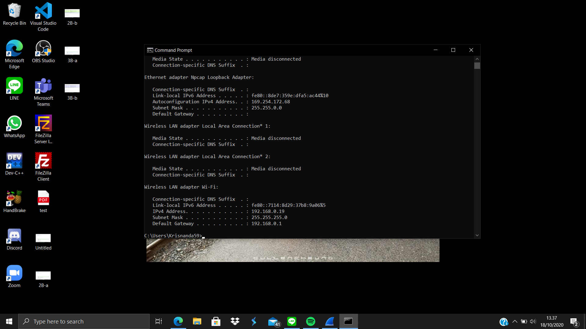

# Lapres Modul 1_T19

**Muhammad Irsyad Ali**  
**Made Krisnanda Utama**

<details>
  <summary> Soal No.1 </summary>
  
  ### Penjelasan Soal  
  Soal meminta kami untuk menampilkan web server yang digunakan pada testing.mekanis.me  
  ### Solusi  
  Kami menggunakan display filter ```tcp contains "testing.mekanis.me"``` sehingga terdapat tiga paket yang tercapture, kemudian kami mem follow tcp strem dari paket dengan 
  info "favicon.ico", 
  
  setelah streamnya terbuka, dapat dilihat bahwa paket ini berasak dari testing.mekanis.ne dan memiliki web server ngin.x seperti yang dapat dilihat di gambar 
  
  ### Kendala  
  Tidak ada.
</details>  

<details>
  <summary> Soal No.2 </summary>
  
  ### Penjelasan Soal   
  Soal meminta kami untuk menemukan dan menyimpan file dengan nama  "Tim_Kunjungan_Kerja_BAKN_DPR_RI_ke_Sukabumi141436.jpg"
  ### Solusi 
  Pertama kami melakukan pencarian terhadap file itu sendiri dengan menggunakan HTTP export object, kemudian menggunakan 
  ```"Tim_Kunjungan_Kerja_BAKN_DPR_RI_ke_Sukabumi141436.jpg"``` sebagai filternya, disiini filter akan menampilkan semua file dengan protocol HTTP dengan nama seperti yang 
  telah disebutkan sebelumnya
  .png)
  Setelah file sudah ditemukan kami melakukan export dan menyimpannya pada local storage, dengan cara men select file tersebut lalu save pada directory tertentu. Hasil dari 
  gambar yang telah disimpan sebagai berikut:  
  
  ### Kendala  
  Tidak ada.
</details>

<details>
  <summary> Soal No.3 </summary>
  
  ### Penjelasan Soal  
  Soal meminta kami untuk mencari username dan password yang telah digunakan untuk login sebelumnya pada website "ppid.dpr.go.id"!
  ### Solusi  
  Kami menggunakan display filter ```http.request.method == POST``` disini semua packet yang berbebentuk POST akan di tampilkan, dimana untuk paket ini mendefinisika sesuatu 
  yang diinputkan kepada web browser, lalu yang kamu temukan adalah satu paket dengan method post seperti yang dapat dilihat dibawah ini 
  
  Kemudian pada paket tersebut memiliki HTML form yang di encoded, dimana di dalamnya memiliki form username dan form password yang merupakan informasi yang telah digunakan 
  untuk melakukan login
      
  ### Kendala  
  Tidak ada.  
</details>  

<details>
  <summary> Soal No.4 </summary>
  
  ### Penjelasan Soal  
  Soal meminta kami untuk menemukan paket dari web-web yang menggunakan basic authentication method.
  ### Solusi  
  Untuk mendapat kan semua paket dari web yang menggunaan basic authentication method, kami menggunakan display filter ```http.authbasic``` namun filter 
  ```http.authorization``` juda dapat digunakan dan akakan memeberikan hasil yang sama. disini filter akan menampilkan semua paket dengan basic authentication seperti yang 
  dapat dilihat pada gambar berikut, kami mendapatkan 5 paket yang tercapture menggunakan basic authentication
    
  ### Kendala
  Tidak ada.  
</details>  

<details>
  <summary> Soal No.5 </summary>
  
  ### Penjelasan Soal  
  Soal meminta kami untuk mengkuti perintah yang ada di ```aku.pengen.pw``` dengan Username dan password yang didapatkan dari file ```.pcapng```
  ### Solusi  
  Kami menggunakan filter ```tcp contains "aku.pengen.pw"``` yang akan menampilkan paket dengan host aku.pengen.pw, kemudian kami membuka detail dari pakeyt tersebut 
  
  Pada bagian hypertext transfer protocol -> Authorization, terdapat text credential yang merupakan username dan password yang dibutuhkan pada aku.pengen.pw  
  
  Setelah dapat mengakses aku.pengen.pw kemudian kami mengikuti intruksi yang ada didalamnya seperti yang dpat dilihat pada gambar berikut
  
  ### Kendala  
  Tidak ada.
</details>  

<details>
  <summary> Soal No.6 </summary>
  
  ### Penjelasan Soal  
  Soal meminta kami untuk menyimpan dan membuka file pdf dengan nama ```"OpenThis.pdf"``` yang di archive dalam ```Answer.zip``` dengan password archive yang sebelumnya harus 
  didapatkan terlebih dahulu pada ```zipkey.txt```
  ### Solusi  
  Pertama kami menggunakan display filter ```ftp-data contains Answer.zip``` yang akan menampilkan beberapa paket yang mungkin berisi Answer.zip itu sendiri, selanjutnya kami 
  memfollow tcp stream pada paket pertama
  
  Sebelumnya kami mencoba beberapa stream untuk kemudian di download raw datanya, kemudian pada stream 12 kami menemukan ```Answer.zip``` dengan mendowload raw datanya
  
  Setelah Answer.zip dibuka, terdapat ```OpenThis.pdf``` yang diminta pada soal, dan untuk memebuka passwordnya kami mencari ```zipkey.txt``` dengan filter 
  ```ftp-data contains zipkey.text```
  
  pada paket pertama kami memfollow tcp streamnya, dan pada stream ke 23 kami menemukan password yang bisa digunakan untuk membuka ```OpenThsi.pdf```
  
  
  Isi dari ````OpenThis.pdf``` yang dibuka dengan key "hey997400323051"
  
  
  ### Kendala  
  Tidak ada.
</details>   

<details>
  <summary> Soal No.7 </summary>
  
  ### Penjelasan Soal  
  Soal meminta kami untuk mencari dan menyimpan salah satu dari lima   ratus file zip yang berisi sebuah file pdf dengan nama 
  ```Yes.pdf```
  ### Solusi  
  Kami menggunakan 
  ### Kendala  
</details>    

<details>
  <summary> Soal No.8 </summary>
  
  ### Penjelasan Soal  
  Soal meminta kami untuk mencari objek apa saja yang didownload 
  (RETR) dari koneksi FTP dengan Microsoft FTP Service  
  ### Solusi  
  Pertama-tama kami mendisplay capture untuk mencari objek yang ada di Microsoft FTP service dengan display filter ```ftp contains "Microsoft"```
  
  Kemudian karena destinasi dan source nya sama kami mempersempit pencarian bertujuan mencari objek yang mengandung RETR) dengan menggunakan display capture        ```ftp.request.command contains "RETR" && ip.dst==198.246.117.106```
  
  ### Kendala
  mboten enten.  
</details>   

<details>
  <summary> Soal No.9 </summary>
  
  ### Penjelasan Soal  
  Soal meminta kami untuk mencari username dan password ketika login 
  FTP pada localhost
  ### Solusi  
  Kami menggunakan 
  ### Kendala  
</details>     

<details>
  <summary> Soal No.10 </summary>
  
  ### Penjelasan Soal  
  Soal meminta kami untuk mencari dan mendownload file .pdf di 
  wireshark dengan clue ```25 50 44 46```
  ### Solusi  
  Kami menggunakan filter ```tcp contains 25:50:44:46``` dimana clue yang diberikan merupakan hex value dari sebuah paket, setelah mendapat satu paket yang terfilter
  
  Kami memfollow stream dari paket tersebut dan mengekportnya sebagai raw data menjadi .pdf, pada case kali ini kami mengeksportnya sebagai "text.pdf"
  
  Berikut merupakan isi dari file pdf yang dimaksud pada soal
  
  ### Kendala  
  Tidak ada.
</details>   

<details>
  <summary> Soal No.1 B </summary>
  
  ### Penjelasan Soal  
  Soal meminta kami untuk menampilkan sehingga wireshark hanya mengambil paket yang mengandung port 21
  ### Solusi  
  Kami melakukan capture filter ke host if.its.ac.id dengan capture filter ```host 103.93.190.11``` dimana 103.93.190.11 merupakan ip if.its.ac.id yang didapat dengan melakukan 
  ping pada cmd
  
  Kemudian kami menggunakan port display capture ```tcp.port == 21``` untuk menampilkan semua paket yang mengandung port 21
  
  ### Kendala
  Tidak ada.
</details>  

<details>
  <summary> Soal No.2 B </summary>
  
  ### Penjelasan Soal  
  Soal meminta kami untuk menampilkan sehingga wireshark hanya mengambil paket yang berasal dari port 80
  ### Solusi  
  Kami melakukan capture filter paket yang berasal dari port 80 dengan capture filter ```tcp src port 80``` 
  
  Lalu kita menampilkan semua paketnya.
  
  ### Kendala  
  Tidak ada.  
</details>  

<details>
  <summary> Soal No.3 B </summary>
  
  ### Penjelasan Soal  
  Soal meminta kami untuk menampilkan sehingga wireshark hanya menampilkan paket yang menuju port 443
  ### Solusi  
  Kami melakukan capture filter paket yang menuju port 443 dengan capture filter```tcp dst port 443``` 
      
  Kemudian kita menampilkan semua paketnya.
  
  ### Kendala  
  Tidak ada.
</details>  

<details>
  <summary> Soal No.4 B </summary>
  
  ### Penjelasan Soal  
  Soal meminta kami untuk menampilkan sehingga wireshark hanya mengambil paket yang berasal dari ip sendiri.
  ### Solusi  
  Kami melakukan pengecekan ip lewat command prompat, memasukkan ```ipconfig```
  
  Kemudian kami melakukan captur filter paket yang berasal dari ip sendiri dengan capture filter ```ip src host 192.168.0.19```
  
  Kemudian kami menampilkan semua paketnya.
  
  ### Kendala
  Tidak ada.  
</details>  

<details>
  <summary> Soal No.5 B </summary>
  
  ### Penjelasan Soal  
  Soal meminta kami untuk menampilkan sehingga wireshark hanya mengambil paket yang tujuannya ke monta.if.its.ac.id
  ### Solusi  
  Kami melakukan capture filter paket yang menuju monta.if.its.ac.id dengan capture filter ```dst host monta.if.its.ac.id```
  
  Kemudian kami menampilkan semua paketnya.
  
  ### Kendala  
  Tidak ada.
</details>   


